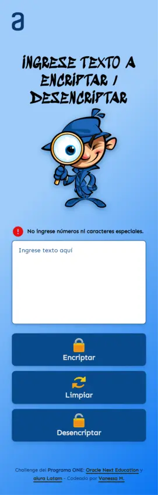
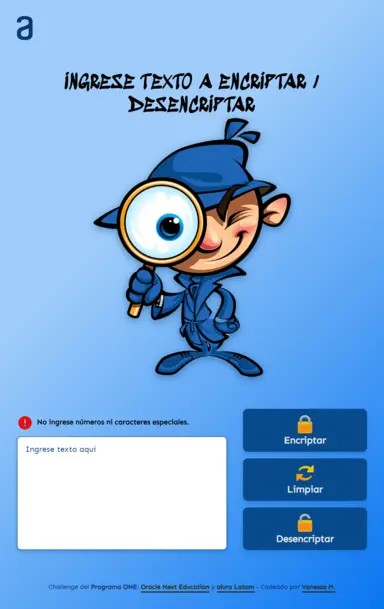
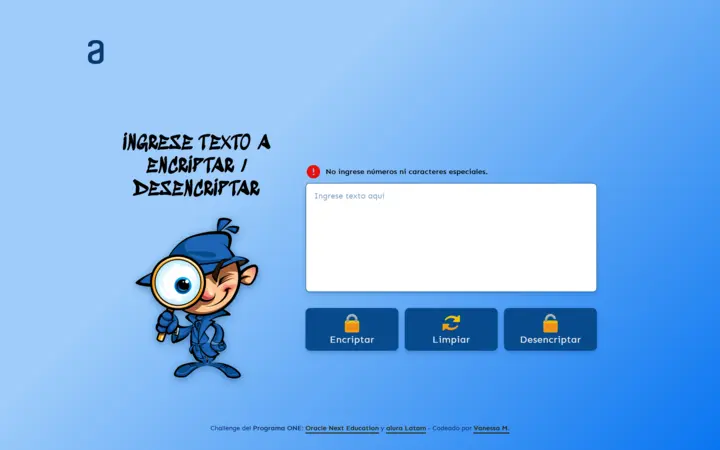

<!-- Abril 2023 -->

# **Encriptador de Texto 🔒**

Este es un challenge del Programa ONE - Oracle Next Education y Alura Latam.

Alura nos da un figma como base para replicar el diseño de la página web; pero no deja claro que nosotros podemos modificar el diseño a nuestro criterio.

<br>
<br>

## **Challenge**
<br>

🎯 La página debe tener un campo para ingresar texto a encriptar o desencriptar.

🎯 El usuario puede escoger entre esas dos opciones.

🎯 Debe funcionar solo con letras minúsculas. No se permiten números ni caracteres especiales.

🎯 Debe devolver el texto en la versión encriptada y desencriptada.

🎯 El resultado debe ser mostrado en pantalla.

  Extra:

🎯 Botones de Copiar y/o Pegar que tengan esas mismas funciones.

<br>
<br>

## **Capturas de Pantalla**
<br>

📳 ***Móvil***



<br>

📱 ***Tablet***



<br>

💻 ***Escritorio***



<br>
<br>

## **Enlaces**

🔗 [Demo](https://vansmp.github.io/encryptor/)

<br>
<br>

## **Desarrollado con:**

<br>

📌 HTML semántico.

📌 JavaScript

📌 CSS custom properties

📌 Grid CSS

📌 Flexbox

📌 Mobile first

<br>
<br>

## **¿Qué he aprendido?**

<br>

✅ Utilizar expresiones regulares: 

  `.test` 👉 busca un **String** en la **regExp**. Devuelve un booleano.

  ```js
  const pattern = /[a-z\s\r\n]/g
      if (!pattern.test(lastKey)) {
        // code
      }
  ```
<br>

✅ **`replace()`** 👉 método que devuelve un **STRING NUEVO** con todas las coincidencias de un patrón sustituidas por un reemplazo. El patrón puede ser un `string` o una `regExp`. El reenplazo puede ser un `string` o una `función`.

🔹 Una forma de reemplazar las vocales es mediante una `CONCATENACIÓN` de `replace()`.
  - patrón: regExp ➡ /e/g, /i/g, ...
  - reemplazo: string ➡ 'enter', 'imes', ...

    ```js
    $outputTxt.value = data.replace(/e/g, 'enter')
                           .replace(/i/g, 'imes')
                           ...
                           .replace(/u/g, 'ufat')
    ```
<br>

🔹 Otra forma de reemplazar las vocales es utilizando un **objeto** y crear un *diccionario*. Así en el futuro si queremos podemos agregar otra *llave* al diccionario.
- patrón: regExp ➡ pattern
- reemplazo: funcion flecha `=>`, donde:
  - `match` es el parámetro de la función que vamos a utilizar como valor de coincidencia. 
  - Con `match` accedemos al valor correspondiente del objeto diccionario, que es entonces devuelto como valor de sustitución.

```js
$const dictionary = {
    ai: 'a',
    ...,
    ufat: 'u'
  }
  stringToEncrypt.replace(pattern, (match) => dictionary[match])
```
<br>

✅ Reemplazar clases de un elemento HTML a través de JS:

```js
$pasteBtn.classList.replace('hidden', 'visible')
```
<br>

✅ `setTimeout` 👉 establece un temporizador que ejecuta un código un vez que el temporizador expira.

```js
setTimeout(() => {
  $msgBox.classList.replace('block', 'none')
}, 1500)
```
<br>

✅ Comprobar si el navegador tiene soporte para **`navigator.clipboard`**

```js
if (!navigator.clipboard) {
  // code
}
// Devuelve True si no tiene soporte
```
<br>

✅ Copiar / Pegar al clipboard:

🔹 Para navegadores que aceptan **`navigator.clipboard`**

```js
// Copiar
navigator.clipboard.writeText($outputTxt.value)
.then (() => console.log('Copia exitosa 👍'))
.catch ((err) => console.error('No se copió 😔 ', err))
```

```js
// Pegar
navigator.clipboard.readText()
.then ((clipData) => $inputTxt.value += clipData)
.catch ((err) => console.error('No se pudo pegar 😔 ', err))
```

🔹 Para navegadores que **NO** aceptan **`navigator.clipboard`**

```js
// COPIAR
// ===================================
// Seleccionamos lo que vamos a copiar
$outputTxt.select()

// Ejecutamos execCommand. Devuelve True si se ejecuto satisfactoriamente. Almacenamos ese booleano en la variable **saveData**
let saveData = document.execCommand('copy')

// Comprobamos si efectivamente la variable es True
if (saveData) {

  // Recuperamos del portapapeles el texto previamente copiado por execCommand y lo almacenamos en una variable que utilizaremos más adelante en la función pegar.
  saveToClip = window.getSelection().toString()
}
```

```js
// PEGAR
// =================================
// Pasamos el contenido de la variable al textarea que muestra los resultados
$inputTxt.value += saveToClip
```
<br>

✅ `userAgent` 👉 muestra información sobre el dispositivo desde donde se invoca; dicha información puede ser del sistema operativo, el navegador utilizado, la versión, etc.

```js
const ua = navigator.userAgent
```
<br>

✅ FireFox no tiene soporte para **`navigator.clipboard.readText`**. En FireFox podemos copiar, pero no pegar a través de la API Clipboard. Entonces, ¿Cómo recuperar el valor copiado del clipboard? No encontre la forma así que utilice un truco 😜:

```js
const ua = navigator.userAgent

// Comprobamos si la página se esta visualizando desde le navegador FireFox
if (ua.match(/Firefox/i)) {

  // Le enviamos un mensaje al usuario para que utilice la combinación de teclas para pegar.
  setTimeout(() => {
    message('Presione [CTRL][V]', 1300)
  }, 2000);
}
```
<br>
<br>

## Recursos útiles
<br>

👉 [Alura Latam](https://www.aluracursos.com/)

👉 [Expresiones Regulares](https://regexr.com/)

👉 [Reemplazar varias letras](https://es.stackoverflow.com/questions/522831/funci%C3%B3n-replace-para-reemplazar-varias-letras)

👉 [Clipboard API](https://developer.mozilla.org/es/docs/Web/API/Clipboard_API)

<br>
<br>

## Autora

Vanessa Méndez
